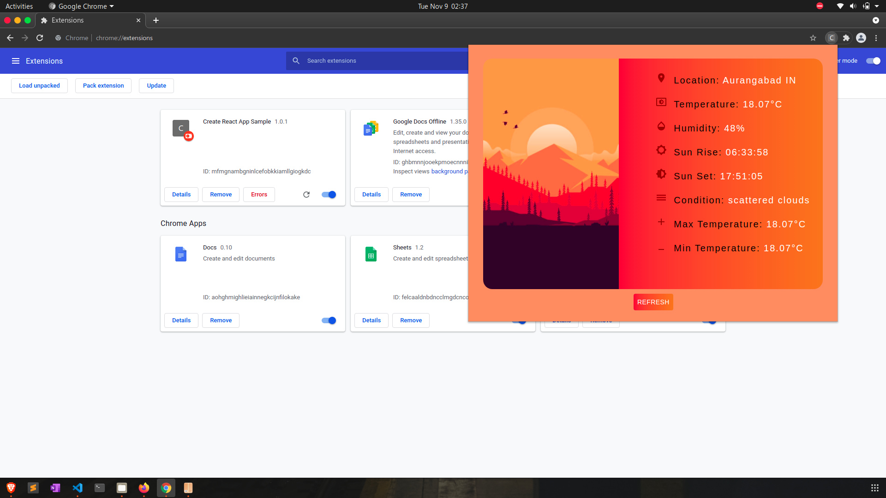

# Weather-App ( Chrome web extension )

Weather-app is a chrome web extension created using react along with Material UI to provide live details about weather in your area, This extension provide details related to current temperature, humidity, min Temperature, max Temperature etc. Geo location API and Open-Weather API are used to  get current location and weather. 

### Sample
